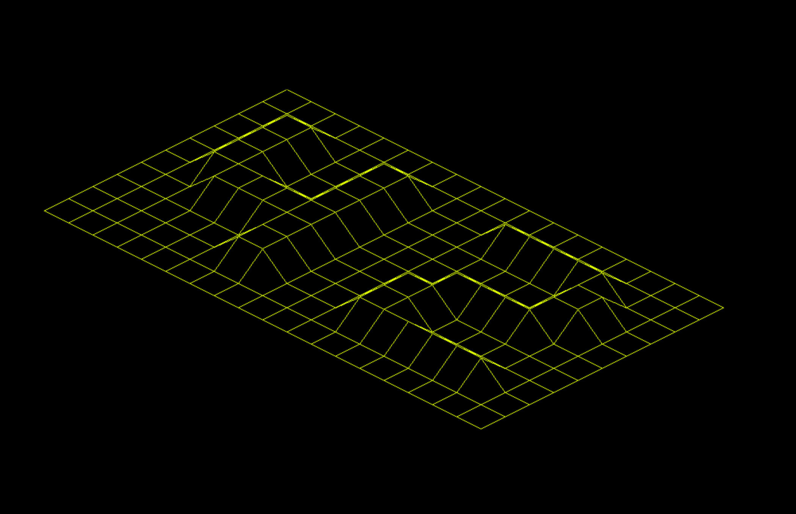

# 42_FDF

Your program has to represent the model in isometric projection

The coordinates of the landscape are stored in a .fdf file passed as a parameter to
your program. Here is an example:
```
0  0  0  0  0  0  0  0  0  0  0  0  0  0  0  0  0  0  0
0  0  0  0  0  0  0  0  0  0  0  0  0  0  0  0  0  0  0
0  0 10 10  0  0 10 10  0  0  0 10 10 10 10 10  0  0  0
0  0 10 10  0  0 10 10  0  0  0  0  0  0  0 10 10  0  0
0  0 10 10  0  0 10 10  0  0  0  0  0  0  0 10 10  0  0
0  0 10 10 10 10 10 10  0  0  0  0 10 10 10 10  0  0  0
0  0  0 10 10 10 10 10  0  0  0 10 10  0  0  0  0  0  0
0  0  0  0  0  0 10 10  0  0  0 10 10  0  0  0  0  0  0
0  0  0  0  0  0 10 10  0  0  0 10 10 10 10 10 10  0  0
0  0  0  0  0  0  0  0  0  0  0  0  0  0  0  0  0  0  0
0  0  0  0  0  0  0  0  0  0  0  0  0  0  0  0  0  0  0
```
Each number represents a point in space:
 - The horizontal position corresponds to its axis.
 - The vertical position corresponds to its ordinate
 - The value corresponds to its altitude.

Executing your fdf program using the example file 42.fdf:

```
./fdf 42.fdf
```
Should render a landscape similar to:

 
 
## FDF Usage

```
Usage:	FDF	fdf_file

Controls:

      [Esc]           -> Exit the program.
      [R]             -> Change color of map to "Red".
      [G]             -> Change color of map to "Green".
      [B]             -> Change color of map to "Blue".
      [Right Shift]   -> Zoom in
      [Left Shift]    -> Zoom out.
      [Arrow keys]    -> Move the map.
```
# Resource
- <a href="https://harm-smits.github.io/42docs/libs/minilibx">MinilibX 42 Docs</a>

## Additional information

For more information you can read the [FdF.pdf](fdf.subject.pdf).
Before using my code for 42 school please double check the Norms.
